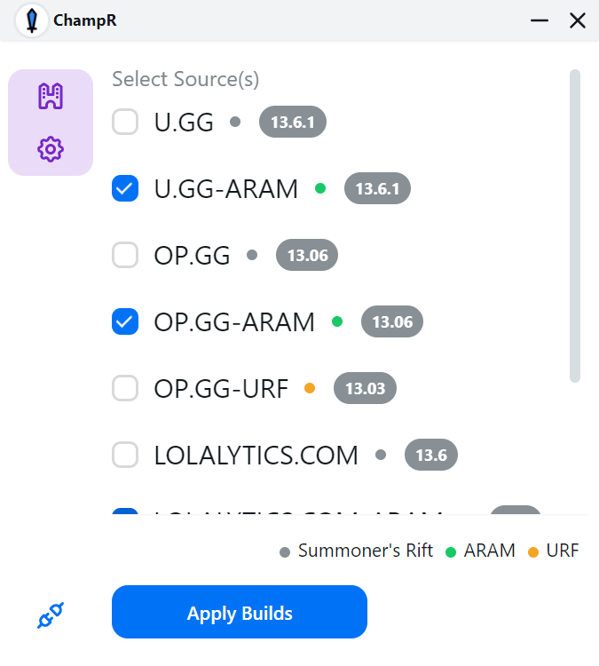
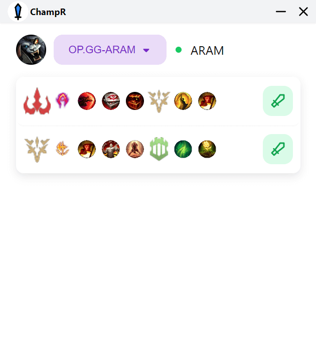
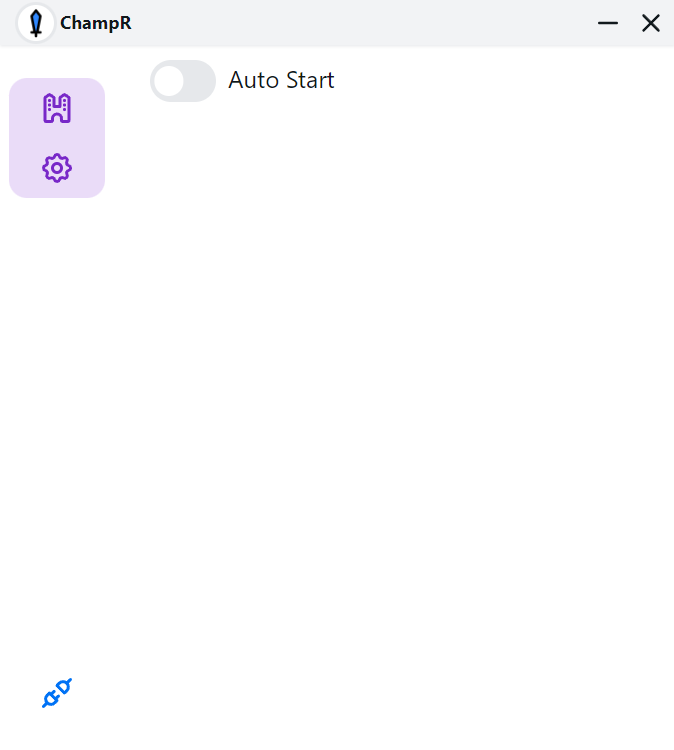

# ChampR

新一代英雄联盟助手

[软件图标](https://www.flaticon.com/free-icon/dog_2767976), 来自 [flaticon.com](https://www.flaticon.com/)

> ❤ 特别感谢 [JetBrains](https://www.jetbrains.com/?from=champ-r) 为本项目赞助的开源许可证

|             出装              |            天赋符文            |              设置               |
|:---------------------------:|:--------------------------:|:-----------------------------:|
|  |  |  |

## 功能

- 📦 自动推荐英雄出装
- 🎉 弹出天赋列表并一键导入
- ✨ 国际化支持
    - 🇨🇳 `简体中文`
    - 🇺🇸 `英语`
    - 🇫🇷 `法语`
- ℹ️ 更新提示
- 😎 针对不同的模式 **召唤师峡谷** / **极地大乱斗** / **无限火力** 提供多种数据源
    - `op.gg`
    - `lolalytics.com`
    - `u.gg`
    - `champion.gg`
    - `murderbridge.com`
    - `101.qq.com`
    - ...

## 下载

> 🎗️ (对于v2用户) 如果你不能运行ChampR v2，需要先安装 [webview2](https://developer.microsoft.com/en-us/microsoft-edge/webview2/#download-section) 

- `v2 开发版` `~4Mb` [Link](https://github.com/cangzhang/champ-r/releases)
- `v1 稳定版` `~70Mb` [Download](https://github.com/cangzhang/champ-r/releases)

## 使用方法

### 导入出装数据

1. 右键以 **管理员** 身份运行 ChampR
2. 选择英雄联盟的 **安装目录**
3. 选择数据源
4. 单击 `导入` 按钮
5.在游戏内商店界面即可选择出装

### Apply Runes

1. 右键以 **管理员** 身份运行 ChampR
1. 选择英雄联盟的 **安装目录**
1. 游戏内选择英雄时会弹出天赋窗口
1. 点击 `应用` 图标

## 常见问题

查看 https://github.com/cangzhang/champ-r/wiki/FAQ

## Star 历史

